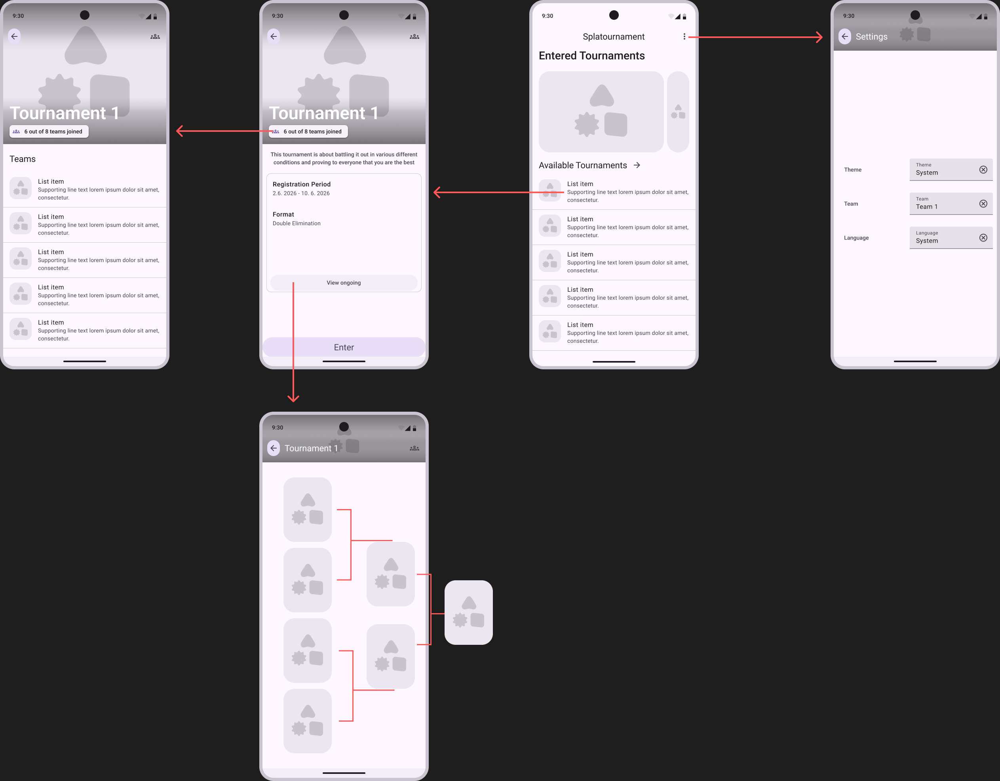

# Concept

## Homescreen

The homescreen of the App should display a list of upcoming tournaments
and a button to a tournament you are participating in.

## Setting

Dropdowns for
- Theme (System, Dark, Light)
- Language (English, German)
Textbox for
- Team Name

## Tournament Detail View

The tournament detail view displays all the information about a tournament,
like

- The registration period
- The maximum amount of teams
- The Tournament Format
- Preview pictures
- A button for registering your Team if in the registration period
- A button to view the stats of the tournament if it has been completed or is currently ongoing

## Tournament Teams View

Displays a List of Teams that have entered the Tournament

## Current Tournament View

The current tournament view displays the current state of an ongoing tournament which the participant entered in.

## Mockups

